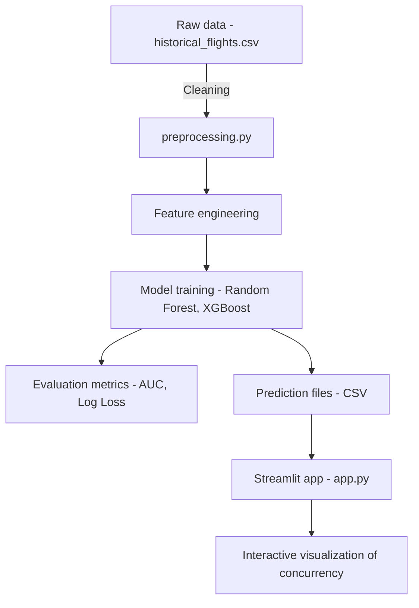
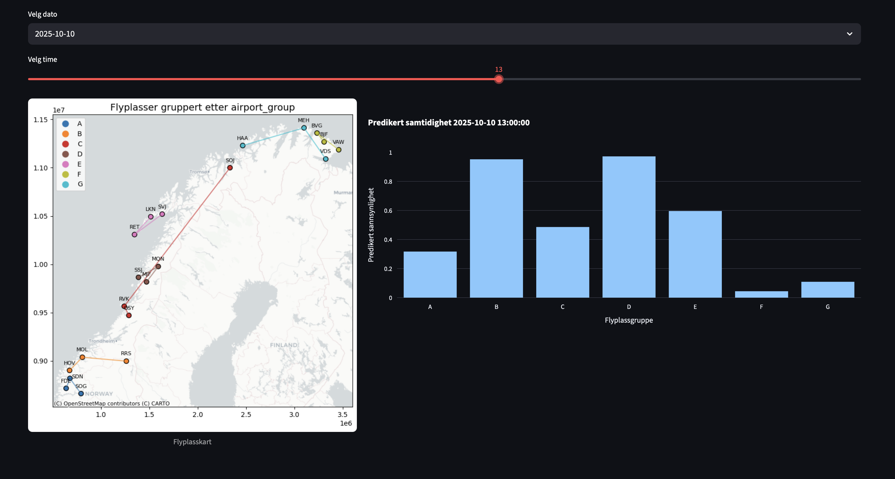

# Avinor Datakonkurranse 2025 – Prediksjon av samtidighet

Dette prosjektet er laget i forbindelse med Avinors datakonkurranse **«Når går det på høygir?»**.  
Målet er å utvikle en maskinlæringsmodell som kan predikere sannsynligheten for samtidighet i kommunikasjon mellom fly og AFIS-fullmektige.  

Prosjektet består av dataforberedelse, feature engineering, modelltrening, evaluering og en enkel Streamlit-app for visualisering av resultater.

For en fullstendig beskrivelse av metode, analyser og resultater:
[Se rapporten her](report/report.pdf)

## a. Metodevalg og tilnærming
Vi valgte en maskinlæringstilnærming fordi samtidighet påvirkes av flere faktorer som tid på døgnet, flytype, antall flyvninger og forsinkelser. Slike mønstre fanges bedre opp av ikke-lineære modeller enn tradisjonelle statistiske metoder.

### Hovedpunkter:
* Features: antall fly per time, planlagt samtidighet, forsinkelsesvariabler (flights_cnt_prev/flights_cnt_next), dato/tid (måned, helg, helligdager), flytypefordeling, samt værdata.
* Modellvalg: Random Forest og XGBoost, fordi de er robuste mot ikke-linearitet og kan håndtere kategoriske/numeriske variabler samtidig.
* Hyperparameter-tuning: Vi brukte RandomizedSearchCV for å gjøre et bredt søk over parametre. HalvingGridSearchCV ble testet, men ga liten gevinst og ble derfor droppet.
* Evaluering: ROC AUC og Log Loss ble brukt som primære metrikker.
 Beste modell ble RandomForest, som ble valgt for endelig innsending.

<br><br><br><br><br><br><br><br><br><br><br><br><br><br><br>
## b. Systemstruktur og arkitektur
### 📂 Prosjektstruktur
Løsningen består av flere steg: datarensing, feature engineering, modelltrening og visualisering via Streamlit.

    ```
    avinor-ai/
    │
    ├── data/
    │   ├── raw_data/              # Originale data fra Avinor (+ airports.csv fra https://ourairports.com/data/)
    │   ├── processed_data/        # Ferdig bearbeidede data (train/val/test/predict_oct2025)
    │   ├── prediction_data/       # Modellens prediksjoner
    │   └── konkurranse_info/      # Informasjon om konkurransen
    │
    ├── notebooksExperimental/     # Utforskning, ikke del av endelig løsning
    │   ├── 02-eda-jakob.ipynb     # Eksperimentell utforskning
    │   ├── 02-eda-tobias.ipynb    # Eksperimentell utforskning
    │   └── 03-visualizations.ipynb# Endelige visualiseringer
    │
    ├── report/
    │   ├── visualizations/        # Visualiseringer brukt i rapporten (png)
    │   ├── report.md              # Rapport i markdown
    │   └── report.pdf             # Ferdig rapport i PDF
    │
    ├── src/
    │   ├── preprocessing.ipynb    # Dataprosessering
    │   ├── model.ipynb            # Modellering
    │   └── app.py                 # Streamlit-app for interaktiv visualisering
    │
    ├── requirements.txt           # Avhengigheter
    └── README.md                  # Denne filen
    ```
<br><br><br><br><br><br><br><br><br><br><br><br>
### 🗂️ Arkitekturdiagram


<br><br><br><br>
## c. Modeller og algoritmer
* Random Forest Classifier (endelig modell)
    * Parametere: n_estimators, max_depth, min_samples_split, min_samples_leaf.
* XGBoost Classifier 
    * Parametere: learning_rate, max_depth, subsample, colsample_bytree, reg_alpha, reg_lambda.
* Hyperparameter-tuning: RandomizedSearchCV (n_iter satt for å balansere tid og kvalitet).
* Evalueringsmetrikker: ROC AUC for klassifiseringskvalitet, Log Loss for kalibrering av sannsynligheter.
Resultatene viste at Random Forest presterte best, med høyere AUC og lavere Log Loss enn Random Forest.

## d. Kildekode
Koden er organisert i src/ for kjørbare scripts og notebooksExperimental/ for utforskende arbeid.
### ⚙️ Installasjon

1. Klon repoet:
   ```bash
   git clone <repo-url>
   cd avinor-ai
   ```

2. Opprett og aktiver miljø:
    ```bash
    conda create -n avinor-ml python=3.13
    conda activate avinor-ml
    ```

3. Installer avhengigheter:
    ```bash
    pip install -r requirements.txt
    ```

### Oppsett

Vi bruker API-en [Frost](https://frost.met.no/index.html) fra *Meteorologisk institutt* for å hente observert/predikert værdata.
For å bruke **Frost**, trenger man en API nøkkel, som kan hentes gratis [her](https://frost.met.no/auth/requestCredentials.html).

Deretter, lager man en `.env` fil i hovedmappen med følgende innhold:

```env
FROST_ID=<client ID>
FROST_SECRET=<...>
```
<br>

### Bruk
1. Preprocessing og modelltrening
    1. Kjør

    ```bash
    preprocessing.ipynb
    ```
    2. Kjøre 

    ```bash
    model.ipynb
    ```

2. Valgfritt: Kjør Streamlit-app
    ```bash
    streamlit run src/app.py
    ```

## e. Innovasjon og kreativitet
#### Oppsummering av modellens egenskaper og styrker
* Høy treffsikkerhet: RandomForest-modellen fanger opp komplekse mønstre i dataene og gir best ytelse av de testede modellene, med høy ROC AUC og lav Log Loss.
* Robusthet: Modellen er trent på en rik feature-sett som inkluderer trafikkmønstre, forsinkelser, værdata og kalenderinformasjon (helg/helligdag). Dette gjør den godt egnet til å generalisere på tvers av ulike flyplasser og tidspunkter.
* Kalibrerte sannsynligheter: Log Loss-optimalisering sikrer at modellens sannsynlighetsestimat kan brukes direkte i beslutningsstøtte, ikke bare som klassifikasjoner.
* Forklarbarhet: Feature importance fra Random Forest gir innsikt i hvilke faktorer som påvirker samtidighet mest – for eksempel antall flyvninger, tid på døgnet og forsinkelser.
#### Kreativ bruk av kunstig intelligens og data
* Ekstern datakilde: Vi har integrert værdata fra Meteorologisk institutt (Frost API), noe som gir et ekstra dimensjonalt lag av informasjon utover Avinors egne data. Værforhold kan påvirke trafikkavvikling og samtidighet, og denne integrasjonen gir Avinor et rikere beslutningsgrunnlag.
##### Kreativ feature engineering:
* Variabler som flights_cnt_prev og flights_cnt_next gir et bilde av kapasitetsdynamikken rundt en gitt time.
* Kalenderbaserte variabler (måned, helg, helligdag) identifiserer systematiske mønstre knyttet til reisevaner.
* Flytypefordeling gjør det mulig å vekte forskjeller mellom småfly og større rutefly.
* Visualisering gjennom Streamlit: Den interaktive appen gjør komplekse prediksjoner lett tilgjengelige for beslutningstakere, med intuitiv navigasjon og visualisering av sannsynligheter.

#### Hvordan modellen kan videreutvikles
* Bedre værdata: Legge til detaljer som vindstyrke, nedbør og siktforhold for å forbedre modellens presisjon.
* Sanntidsintegrasjon: Koble modellen direkte mot Avinors operative systemer og eventuelle API-er for kontinuerlig prediksjon og overvåking.
* Utvidet modellutvalg: Utforske nevralnettverk eller ensemble-metoder som kombinerer flere modeller for ytterligere ytelsesforbedring.
* Prediksjon på flere nivåer: Ikke bare vurdere samtidighet, men også estimere hvor alvorlig samtidigheten er (grad av overlapp/varighet).
* Operativ verdi: Bruke modellen til å simulere effekten av trafikkøkning, værendringer eller bemanningsjusteringer.

## App
Vi har utviklet en interaktiv Streamlit-app som gjør det mulig å utforske prediksjonene på en intuitiv måte.
Appen visualiserer sannsynligheten for samtidighet per flyplassgruppe, og lar brukeren enkelt navigere i dataene gjennom ulike kontroller.
Hovedfunksjonalitet
Tidspunkt-valg:
* Brukeren kan velge dato via en sjekkboks eller dropdown.
* Brukeren kan velge time via en slider.
Visualisering:
* Et interaktivt stolpediagram (Plotly) viser predikert sannsynlighet for samtidighet (pred) for hver flyplassgruppe.
* Verdiene normaliseres til intervallet [0,1], slik at sannsynligheten er lett å tolke.
Kartvisning:
* Et statisk kartbilde av flyplassgruppene plasseres på venstre side av skjermen for å gi en geografisk kontekst.
* Diagrammet oppdateres til høyre basert på valgt tidspunkt.




## Videreutvikling og skalering
* Legge til mer detaljerte værdata (vind, sikt, nedbør).
* Optimalisere API-call til værdata
* Teste andre modeller som ElasticNet eller Neural Networks.
* Optimalisere XGBoost med større hyperparameter-søk.
* Integrere systemet direkte mot sanntidsdata fra Avinor API (hvis tilgjengelig).


## Bidragsytere
Prosjekt utviklet av:
Jakob Brekke Berg,
Jonas Mathisen Sterud,
Tobias Andreas Munch,
Universitetet i Bergen, 2025.

