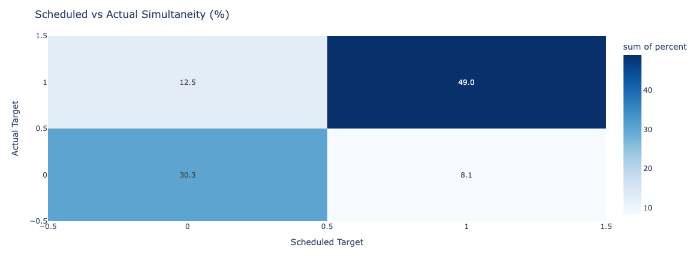
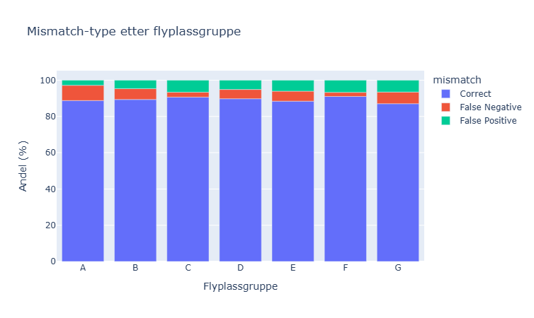
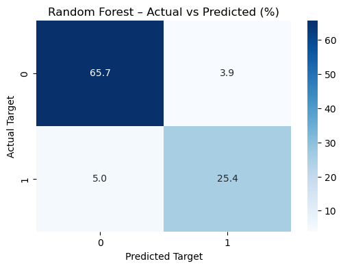

# Rapport - Avinor Data konkurannse 2025 

## 1. Innledning
Denne rapporten beskriver vår tilnærming til å utvikle en prediksjonsmodell for samtidighet i flyplassgrupper, i forbindelse med Avinors datakonkurranse «Når går det på høygir?». Målet er å estimere sannsynlighet for samtidighet per flyplassgruppe per time, der samtidighet betyr at en AFIS-fullmektig er i aktiv dialog med to eller flere fly samtidig

Vi benytter historiske flydata til å trene modeller og evaluerer ytelsen ved hjelp av AUC og log loss, i tråd med konkurransens evalueringskriterier

  

## 2. Datagrunnlag og utforskende analyse
Datasettet historical_flights.csv inneholder detaljerte opplysninger om flyvninger, både planlagte og faktiske. Variablene kan deles inn i tre hovedkategorier: identifikasjon, operasjonelle opplysninger og tidsstempler:

<small>

* flight_id – unikt flyvningsnummer, der de to første tegnene identifiserer flyselskapet. Gir mulighet til å skille flyvninger og analysere mønstre per selskap.
* dep_airport – avgangsflyplass, en kortkode (f.eks. BGO for Bergen). Brukes til å knytte flyvningen til en geografisk lokasjon.
* dep_airport_group – hvilken flyplassgruppe avgangsflyplassen tilhører. Viktig for konkurransen, siden samtidighet måles på gruppenivå.
* arr_airport – ankomstflyplass, tilsvarende dep_airport.
* arr_airport_group – flyplassgruppen ankomstflyplassen tilhører.
* service_type – flyvningstype, f.eks. rutefly (J), charter (C) eller frakt (P). 
* std (Scheduled Time of Departure) – planlagt avgangstid.
* sta (Scheduled Time of Arrival) – planlagt ankomsttid.
* cancelled – indikator (0/1) for om flyvningen ble kansellert. Viktig å filtrere ut, da kansellerte flyvninger ikke genererer faktisk trafikk.
* atd (Actual Time of Departure) – faktisk avgangstid.
* ata (Actual Time of Arrival) – faktisk ankomsttid.
</small>

Planlagte tider (std, sta) danner grunnlag for en forventet trafikkflyt, mens faktiske tider (atd, ata) gjør det mulig å oppdage forsinkelser og avvik. Differansen mellom disse er ofte årsaken til samtidighet, og dermed sentral i modelleringen.

### 2.1 Databehandling

Dataene ble renset og transformert slik:

<small>

* Konverterte tidsvariabler til datetime-format - for å kunne beregne intervaller, forsinkelser og aggregere flyvninger på time-/dagsnivå på en konsistent måte.

* Fjernet urealistiske flytider (negative eller over 10 timer) - for å håndtere feilregistreringer eller datastøy som ellers ville kunne skape feil i beregningene av kommunikasjonsintervaller og mislede modellen.
</small>

### 2.2 Utforskende analyse

Vi ønsker å analysere når samtidighet oppstår i kommunikasjonen med AFIS-fullmektig per flyplass-gruppe. I motsetning til store flyplasser der det er flere AFIS-fullmektige, har mindre flyplasser en felles AFIS-fullmektig grunnet at det er betydeligere lavere flytrafikk. Kommunikasjon mellom fly og AFIS-fullmektig er 15 minutter før til 6 minutter etter for avgang og 15 minutter før til etter 8 minutter etter for landing. Vi ønsker å se når det er samtidighet i denne kommunikasjonen for følgende flyplasser og deres flyplass-gruppe.

Som en del av den utforskende analysen har vi sett på sammenhengen mellom planlagt samtidighet (target_sched) og faktisk samtidighet (target_actual). Figuren under viser resultatene både som antall tilfeller og som prosentandeler:

Analysen viser at i 49 % av tilfellene der planlagte tider indikerer overlapp, oppstår det også faktisk samtidighet. Tilsvarende ser vi at i 30,3 % av tilfellene uten planlagt overlapp, skjer det heller ingen faktisk overlapp. Dette innebærer at i 79,3 % av tilfellene er planlagt tidsinformasjon alene tilstrekkelig for å predikere samtidighet korrekt.

Det gjenstår imidlertid 20,7 % av tilfellene hvor planlagte tider ikke stemmer med faktisk utfall: enten var samtidighet planlagt uten å inntreffe, eller så oppstod samtidighet selv om det ikke var planlagt. Dette avviket er spesielt interessant, og videre analyse og modellering vil fokusere på å forstå hvilke faktorer som forklarer disse tilfellene.

  
  
  
  
  
  

### Antall flyvninger

Vi ønsker å se når i løpet av tidsintervaller på 1 time det vil skje en samtidighet. Grunnet at hver fly vil ha en kommunikasjonstid med AFIS-fullmektig på enten 23 eller 21 minutter vil det være naturlig å se på hvor mange fly vi har den gitte timen, og hvordan det påvirker target og target scheduled.

Figuren viser hvordan prediksjonene av samtidighet (target scheduled) samsvarer med de faktiske observasjonene (target actual) for ulike antall flyvninger per time.
Vi ser at når antall fly per time øker, blir andelen korrekte prediksjoner svært høy. Allerede ved 4 fly eller mer per time er andelen korrekte tilfeller over 95 %, og fra 6 fly og oppover er den praktisk talt 100%.
Ved lavere trafikk (1–3 fly per time) ser vi flere avvik:

* Allerede ved 1 fly per time ser vi en betydelig andel falske negative. Dette kan skyldes at flyet ikke faktisk gikk i sitt planlagte timeintervall, men i stedet overlappet med et annet fly som var forventet i en annen time. Det kan også være at et fly fra et annet timeintervall ble forsinket og dermed endte opp i samme tidsrom, slik at kommunikasjonen overlappet.
* Med 2 fly per time oppstår både falske positive og falske negative, noe som indikerer at scheduled target har utfordringer med å fange samtidighet korrekt i grensetilfellene.
* Med 3 fly per time dominerer de falske negative, mens falske positive reduseres.
* Ved høyere trafikk (4+ fly per time) øker treffsikkerheten raskt, og andelen korrekte prediksjoner er nær 100 %. Dette viser at prediksjonskvaliteten er svært god ved høy trafikk, mens de mest krevende situasjonene oppstår når vi har få fly per time.

Totalt sett viser figuren at prediksjonskvaliteten er svært god ved høy trafikk, mens de mest utfordrende situasjonene å predikere oppstår når vi har 1–3 fly på en time.

  

På grafen under, ser vi en visualiser av antall flyvninger i løpet av en dag og hvordan dette påvirker samtidighet i forhold til hva som var planlagdt. Den viser hvordan falske negativer, falske positiver og de korrekte samtidigheten endrer seg med antallet flyvninger.

Ut i fra grafen, så kan vi lære et par ting. Vi ser at antall korrekte samtidigheter i følge planen går ned fra 100% til 85% når vi treffer 50 flyvninger på en dag. Etter 50 flyvninger så går den litt opp igjen til omtrent 90%. Vi ser også at jo flere flyvninger det blir, jo høyere blir adelen av feilene som er falske negativer (uplanlagdte samtidigheter). Fra 0-37 flyvninger per dag er det mer falske positiver, men etter dette blir det flere av falske negativer.
  
  

### Forsinkelser

En sentral årsak til disse avvikene er forsinkelser. Dersom fly ikke går eller lander på det planlagte tidspunktet, kan kommunikasjonen overlappe selv om dette ikke var forventet i den opprinnelige planen. For å undersøke dette ser vi nærmere på hvordan forsinkelsene fordeler seg. Vi filtrerer bort ekstreme tilfeller, der noen få fly har forsinkelser på flere dager, og får dermed et mer representativt bilde av den typiske variasjonen.

Ettersom forsinkelsen har lange haler både for positiv og negativ forsinkelse vil en t-fordeling med parametere df=3.7 og mu=-1.98 og sigma=8.02 være et godt estimat på fordelingen forsinkelsen tas fra. Her ser vi at de aller fleste fly har nesten ingen forsinkelse. Likevel vil et skift fra dette midtpunktet gjøre at oppsatt tid ikke vil kunne alene beskrive om det vil forekomme samtidighet eller ikke.

  

### Forskjellige tider på året

Figuren viser andelen samtidighet per måned gjennom året. Vi ser en markant sesongvariasjon: andelen samtidighet er lavest i april–mai (ca. 30 %), men øker jevnt utover sommeren og når en topp på rundt 36 % i september–oktober. Deretter faller andelen igjen mot desember. Dette indikerer at høsten har en klart høyere andel samtidige flybevegelser, noe som kan skyldes både økt trafikkvolum og mer komplekse avvik i denne perioden.
  
  

### Flyplassgrupper
  
I stolpesiagrammet under ser vi på forskjellene i de forskjellige flyplassgruppene. Vi ser etter her er om det er noe forskjeller i mengden eller typen feil om blir gjort. Ut i fra dette kan vi finne ut om flyplassgruppene kan påvirke samtidigheten. 

Det ser ikke ut til å være en veldig stor forskjell i antallet feil som blir gjort per flyplassgruppe. Det er noen forskjell mellom noen av gruppene, men den er ikke en betydelig forskjell. Det som det var forskjell i var typen feil som ble gjort mellom gruppene. Gruppe A gjorde veldig mange falske negativer (8,4%), men gruppe C og F gjorde mange falske positiver (ca 6,7% op begge). Dette viser oss at det er forskjell i gruppene, men kun i typen feil.
  
  

### Flyselskaper
  
Nå ser vi på forskjellene i de 5 mest brukte flyselskapene i datasettet. Vi har kun valgt å ha med de flyselskapene som var modolusen til forskjellige 500 timer i datasettet. Det vi ser etter her er om det er noe forskjeller i mengden eller typen feil om blir gjort. Ut i fra dette kan vi finne ut om flyselskapet kan påvirke resultatene våre. 

Måten vi har funnet ut av flyselskapene er ved å se på de første bokstavene i "flight_id". Dette ser ut til å vise til en IATA kode for flyselskaper i de fleste tilfeller. Det er noen eksempler hvor vi får ut koder på andre formater. LPA er et eksempel på en kode som vi fikk ut på denne måten som ikke er en IATA kode. Det kan hende at dette er en annen form for referanse til flyselskap eller at det betyr "Gran Canaria Airport".

Ut ifra dette stolpediagramet, så ser vi at det er ganske store variasjoner i de forskjellige flyselskapene. Den tydeligste forskjellgen er i "flyselskapet" LPA som har en mye støre andel av falske negativer. Dette vil si at det ofte er planlagt at ikke det blir samtidighet, men at det skjer uansett. En annen tydelig forskjell er i selskapet DY (Norwegian Air Shuttle) som har det helt omvendt. Der er det større sansynlighet for at det er planlagdt samtidighet, men at det ikke ender opp med å skje. Selskapet som har samtidigheter som passer best med de planlagdte flyvningnene er SK (Scandinavian Airlines). Dette viser oss at hvilket flyselskap som er i bruk ser ut til å påvirke om det blir samtidighet eller ikke.
  
  
### 2.3 Foreløpige observasjoner

Samtidighet oppstår hyppigst når trafikkmengden er høy.

Samtidighet oppstår mer i noen flyselskaper enn hos andre. 

Planlagt samtidighet gir en indikasjon, men fanger ikke opp alle reelle overlapp.

  

## 3. Metodevalg og tilnærming
### 3.1 Intervall- og target-konstruksjon
For å identifisere samtidighet ble det konstruert intervaller for kommunikasjon:

* Avgang: 15 min før → 8 min etter faktisk avgang.

* Ankomst: 16 min før → 5 min etter faktisk landing.

Ved overlapp i disse intervallene oppstår samtidighet. Dette ble aggregert per flyplassgruppe × time, og brukt til å lage target-variablene 
* target_actual (basert på faktiske tider) 
* target_sched (basert på planlagte tider).

### 3.3 Feature engineering
For å gjøre datasettet egnet til prediksjon ble det gjennomført en rekke trinn med feature engineering, basert på både de rå flydataene og eksterne kilder:

Operasjonelle features
* flights_cnt: Antall flyvninger per time er direkte knyttet til sannsynligheten for overlapp. Jo flere fly som skal håndteres innenfor samme time, desto større sjanse for at kommunikasjonsintervallene overlapper.Analysen viste at samtidighet nesten alltid oppstår når antallet er høyt (≥4), mens det er mer usikkert ved 1–3 fly per time. Dette underbygger hvorfor flights_cnt ble valgt som en sentral feature.
* flight_cnt_prev, flights_cnt_next: Tar hensyn til forsinkelser. Et fly som egentlig var planlagt i timen før kan bli forsinket og dermed overlappe med inneværende time, mens et fly fra neste time kan ankomme tidligere enn planlagt og dermed påvirke den samme perioden. Disse lag-variablene fanger opp slike forskyvninger. Som vist i tidligere visualiseringer ligger de fleste avvik i oppsatt tid innenfor intervallet [-30, 30] minutter, noe som gjør det naturlig å inkludere fly fra både forrige og neste time.
* daily_flights_cnt: Summerer trafikkmengden for hele dagen. Høy daglig trafikk kan øke belastningen og risikoen for forsinkelser, noe som igjen påvirker samtidighet.
* avg_duration og max_duration: Gjennomsnittlig og maksimal planlagt flytid, beregnet fra sta – std.
* passenger_share, cargo_share, charter_share: Andel av flyvningene i timen som er passasjer-, frakt- eller charterfly.
* airline: dominerende flyselskap i timen (modus). Hentet fra de første bokstavene i "flight_id"

Tidsfeatures
* dow: ukedag (0-6). Trafikkmengden varierer systematisk gjennom uken.
* month: Måned. Brukt for å fange opp sesongvariasjoner.
* hournum: Time på døgnet. Trafikk varierer over døgnet, noe som påvirker samtidighet.
* weekend: Om timen faller på helg.
* holiday: Om dagen er en offentlig helligdag i Norge.

Targets
* target_actual: faktisk samtidighet (overlapp i avganger og ankomster, beregnet fra faktiske tider atd/ata).
* target_sched: planlagt samtidighet (beregnet fra planlagte tider std/sta), som i analysen viste seg å stemme i ca. 80 % av tilfellene.

Andre kilder
* Flyplassgrupper ble koblet på geografiske koordinater (airportgroups.csv og airports.csv).
* Klimadata (temperatur, nedbør, vind) ble koblet inn via Frost API, basert på nærmeste værstasjon til hver flyplassgruppe.

Kort sagt: Vi startet med rå flydata, renset bort ugyldige eller ekstreme registreringer, og konstruerte et fullstendig timegrid per flyplassgruppe. Deretter ble intervaller for avgang/ankomst utvidet til timeaggregater, og både tidsbaserte og operasjonelle features ble lagt på. Til slutt ble eksterne variabler som helligdager og vær inkludert for å fange opp sesong- og miljøeffekter.

### 3.4 Baseline modeller
Vi etablerte to enkle baselines:

1. Bruke target_sched direkte som prediksjon → ga AUC og log loss som referanse. 
    
2. Majoritetsklassifikator (andel samtidighet i trening) → ga et alternativt sammenligningspunkt.
    

### 3.5 Modellvalg

Vi testet to klassifikasjonsmodeller: Random Forest Classifier og XGBoost Classifier. Begge modellene ble implementert i en scikit-learn Pipeline, hvor preprocessing bestod av OneHotEncoder for kategoriske variabler og passthrough for numeriske variabler.
For hyperparameter-tuning benyttet vi RandomizedSearchCV for å gjøre et bredt søk over mulige hyperparametere. Vi testet også HalvingGridSearchCV for mer finjustert tuning, men dette ga liten til ingen forbedring i modellresultatene og ble derfor droppet.
De beste modellene fra RandomizedSearchCV ble deretter evaluert på valideringsdatasettet. Resultatene for de to modellene er vist under:

RandomForestClassification
* Accuracy:
* AUC: 
* Log-loss: 

XGBoostClassification
* Accuracy:
* AUC: 
* Log-Loss

Dermed har vi valgt XGBoostClassification som endelig modell, og evaluerer denne på test-dataen.

  

## 4. Resultater
### 4.1 Baseline

Baseline med target_sched: moderat AUC, men høy log loss (overkonfidens).
* AUC: 0.856 
* Log-loss: 0.852

Majoritetsmodell: lav prediksjonsevne, men jevn log loss.
* AUC: 0.5
* Log-loss: 0.627

### 4.2 Random Forest

Accuracy: (resultat)

Figuren over viser confusion matrix for Random Forest-modellen på testsettet, uttrykt i prosent. Vi ser at modellen predikerer korrekt i 90,9 % av tilfellene (63,9 % + 27,0 %), mens feilprediksjoner utgjør henholdsvis 5,7 % falske positive og 3,4 % falske negative. Dette innebærer at modellen i stor grad klarer å identifisere samtidighet når den faktisk forekommer, samtidig som den i liten grad overpredikerer tilfeller der det ikke er samtidighet.
Sammenligner vi dette med baseline-figuren (Scheduled vs Actual), ser vi en klar forbedring. Baseline basert på planlagte tider treffer riktig i 79,3 % av tilfellene (49,0 % + 30,3 %), men har en høyere andel feilprediksjoner (20,7 % totalt). Random Forest-modellen reduserer altså feilraten betydelig ved å fange opp avvik som skyldes forsinkelser og andre operasjonelle forhold som ikke reflekteres i planlagte tider.
Dette viser at modellen tilfører klar merverdi utover baseline, særlig ved å redusere antallet falske negative – altså tilfeller hvor planlagte tider indikerer ingen samtidighet, men hvor det i realiteten oppstår overlapp.

AUC: (resultat)

Figuren viser ROC-kurven (Receiver Operating Characteristic) for Random Forest-modellen på testsettet. Kurven illustrerer forholdet mellom True Positive Rate (sensitivitet) og False Positive Rate (1–spesifisitet) for ulike terskelverdier.
AUC (Area Under the Curve) er beregnet til 0,964, noe som indikerer svært høy diskrimineringsevne. Det betyr at modellen i 96,4 % av tilfellene vil rangere et tilfeldig valgt positivt tilfelle høyere enn et negativt tilfelle.
Den tydelige buen langt over diagonal-linjen (tilfeldig gjetning) viser at modellen er betydelig bedre enn en naiv klassifikator, og at den har god balanse mellom å oppdage samtidighet (høy sensitivitet) og å unngå falske alarmer (lav falsk positiv rate).

Log Loss: (resultat)

### 4.3 Feature importance

De viktigste feature-gruppene i modellen var:
* Antall flyvninger per time (flights_cnt) – den klart mest informative variabelen. Sannsynligheten for samtidighet øker kraftig når antall flyvninger per time passerer et visst nivå, slik vi også så i den utforskende analysen. Mange fly på kort tid gir større sjanse for overlapp i kommunikasjonsintervallene.

* Planlagt samtidighet (target_sched) – gir et sterkt signal fordi den baserer seg på de planlagte tidspunktene for avganger og ankomster. Selv om den ikke fanger opp alle forsinkelser, stemmer planlagt samtidighet med faktisk utfall i rundt 80 % av tilfellene og er dermed en god prediktor.

* Andel passasjerfly (passenger_share) – reflekterer at ulike flytyper kan ha ulik regularitet og påvirkning på samtidighet. Rutefly (passasjerfly) opererer gjerne etter faste tidspunkter og er mer utsatt for koordinerte topper i trafikken, noe som kan forklare hvorfor andelen passasjerfly har høy betydning.

* Maksimal og gjennomsnittlig flytid (max_duration, avg_duration) – lengre flytider kan være knyttet til større ruter og mer trafikkerte avganger/ankomster, som igjen øker sjansen for overlapp i AFIS-kommunikasjonen. De gir også et indirekte signal om hvilken type trafikk som dominerer i et gitt tidsrom.

* Lag-variabler for nabotimer (flights_cnt_prev, flights_cnt_next) – bidrar med informasjon om forskyvninger i trafikken. Dersom et fly blir forsinket fra forrige time eller ankommer tidligere enn planlagt fra neste time, kan det skape samtidighet i nåværende time.

* Tidsvariabler (hournum, month, dow) – hjelper modellen å fange opp mønstre som varierer over døgnet, uken og året. Selv om disse variablene er mindre viktige enn de operasjonelle, bidrar de til å fange sesongvariasjoner og systematiske trafikkmønstre.

Totalt sett viser feature importance-analysen at samtidighet først og fremst drives av trafikkmengde og planlagte tidspunkter, men at trafikktyper, varighet og forskyvninger i tid også gir viktige bidrag.

## 5. Systemstruktur og arkitektur

Løsningen er bygget som et modulært Python-system:

* preprocess.ipynb: full pipeline for lasting, rensing og feature engineering.

* model.ipynb: trenings- og evalueringslogikk.

* app.py: visualiserer resultatet av oktober 2025

Dette muliggjør enkel reproduserbarhet og videreutvikling.

  

## 6. Videre arbeid

Vi har allerede inkludert eksterne kilder som værdata, helligdager og sesonginformasjon, men ser flere muligheter for videre forbedring:

* Mer detaljerte værdata: Vi har benyttet standard klimadata (temperatur, nedbør, vind), men det kunne vært nyttig å hente mer flytekniske værvariabler dersom dette var lettere tilgjengelig, for eksempel siktforhold, skydekke, turbulensvarsler eller vindretning på rullebane. Slike forhold kan ha direkte innvirkning på forsinkelser og samtidighet.
* Forbedret hyperparameter-tuning: Vi har gjennomført både RandomizedSearchCV og HalvingGridSearchCV, men kunne utvidet med mer avanserte søkestrategier (f.eks. Bayesian Optimization) for ytterligere å optimalisere modellene.
* Feature-utvidelser: Utforske hvordan forsinkelser forplanter seg i kjeder (cascade-effekter), der en forsinkelse på ett fly kan påvirke neste rotasjon eller andre fly i samme flyplassgruppe

  

## 7. Konklusjon

Vi har etablert en komplett pipeline for å predikere samtidighet ved Avinors flyplassgrupper. Våre første resultater viser at Random Forest gir klart bedre prediksjoner enn baseline, og feature importance indikerer at både planlagte samtidigheter og flyintensitet er sentrale drivere.

https://ourairports.com/data/
