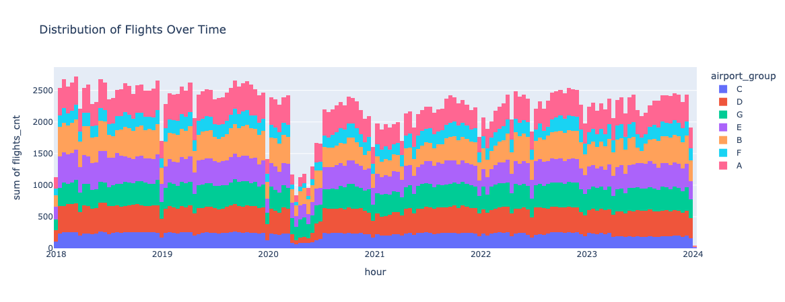

# Rapport - Avinor Data konkurannse 2025 

## 1. Innledning
Denne rapporten beskriver vår tilnærming til å utvikle en prediksjonsmodell for samtidighet i flyplassgrupper, i forbindelse med Avinors datakonkurranse «Når går det på høygir?». Målet er å estimere sannsynlighet for samtidighet per flyplassgruppe per time, der samtidighet betyr at en AFIS-fullmektig er i aktiv dialog med to eller flere fly samtidig

Vi benytter historiske flydata til å trene modeller og evaluerer ytelsen ved hjelp av AUC og log loss, i tråd med konkurransens evalueringskriterier

## 2. Datagrunnlag og utforskende analyse
Datasettet historical_flights.csv inneholder detaljerte opplysninger om flyvninger, både planlagte og faktiske. Variablene kan deles inn i tre hovedkategorier: identifikasjon, operasjonelle opplysninger og tidsstempler:

<small>

* flight_id – unikt flyvningsnummer, der de to første tegnene identifiserer flyselskapet. Gir mulighet til å skille flyvninger og analysere mønstre per selskap.
* dep_airport – avgangsflyplass, en kortkode (f.eks. BGO for Bergen). Brukes til å knytte flyvningen til en geografisk lokasjon.
* dep_airport_group – hvilken flyplassgruppe avgangsflyplassen tilhører. Viktig for konkurransen, siden samtidighet måles på gruppenivå.
* arr_airport – ankomstflyplass, tilsvarende dep_airport.
* arr_airport_group – flyplassgruppen ankomstflyplassen tilhører.
* service_type – flyvningstype, f.eks. rutefly (J), charter (C) eller frakt (P). 
* std (Scheduled Time of Departure) – planlagt avgangstid.
* sta (Scheduled Time of Arrival) – planlagt ankomsttid.
* cancelled – indikator (0/1) for om flyvningen ble kansellert. Viktig å filtrere ut, da kansellerte flyvninger ikke genererer faktisk trafikk.
* atd (Actual Time of Departure) – faktisk avgangstid.
* ata (Actual Time of Arrival) – faktisk ankomsttid.
</small>

Planlagte tider (std, sta) danner grunnlag for en forventet trafikkflyt, mens faktiske tider (atd, ata) gjør det mulig å oppdage forsinkelser og avvik. Differansen mellom disse er ofte årsaken til samtidighet, og dermed sentral i modelleringen.

### 2.1 Databehandling

Dataene ble renset og transformert slik:

<small>

* Fjernet kansellerte flyvninger - fordi disse ikke representerer faktiske operasjoner og derfor ikke kan bidra til å forklare samtidighetssituasjoner.

* Konverterte tidsvariabler til datetime-format - for å kunne beregne intervaller, forsinkelser og aggregere flyvninger på time-/dagsnivå på en konsistent måte.

* Fjernet urealistiske flytider (negative eller over 10 timer) - for å håndtere feilregistreringer eller datastøy som ellers ville kunne skape feil i beregningene av kommunikasjonsintervaller og mislede modellen.
</small>

### 2.2 Utforskende analyse

Som vi ser på figuren nedenfor har vi data fra 2018 til 2023 som viser en ganske stabilt antall med flyavganger/flylandinger for hele perioden. Likevel er det visse unntak blant annet juletider og koronaperioden mars-juni 2020.

Som en del av den utforskende analysen har vi sett på sammenhengen mellom planlagt samtidighet (target_sched) og faktisk samtidighet (target_actual). Figuren under viser resultatene både som antall tilfeller og som prosentandeler:

Analysen viser at i 49 % av tilfellene der planlagte tider indikerer overlapp, oppstår det også faktisk samtidighet. Tilsvarende ser vi at i 30,3 % av tilfellene uten planlagt overlapp, skjer det heller ingen faktisk overlapp. Dette innebærer at i 79,3 % av tilfellene er planlagt tidsinformasjon alene tilstrekkelig for å predikere samtidighet korrekt.

Det gjenstår imidlertid 20,7 % av tilfellene hvor planlagte tider ikke stemmer med faktisk utfall: enten var samtidighet planlagt uten å inntreffe, eller så oppstod samtidighet selv om det ikke var planlagt. Dette avviket er spesielt interessant, og videre analyse og modellering vil fokusere på å forstå hvilke faktorer som forklarer disse tilfellene.

Vi ønsker å skje når i løpet av tidsintervaller på 1 time det vil skje en samtidighet. Grunnet at hver fly vil ha en kommunikasjonstid med AFIS-fullmektig på enten 23 eller 21 minutter vil det være naturlig å se på hvor mange fly vi har den gitte timen. 

Figuren prosentandelen for samtidighet for gitte antall fly per time. Som vi ser på figuren vil vi om vi har flere enn 4 fly på en time alltid ha samtidighet. Dette grunnet at det ikke er mulig at de ikke overlapper. Videre om vi har 3 fly vil vi i cirka 98% av tilfellene få en samtidighet, da flyene er nødt til å time tidsrommet veldig bra. Om vi har 2 fly vil vi ha samtidighet i cirka 78% av tilfellen mens vi vil ikke ha noen samtidighet dersom det bare er ett fly i det tidsrommet. Utifra dette ser vi at det er spesielt tidsrommene som har 2 fly på en time som vil være utfordrene å predikere.

Vi ser her at i de aller fleste tilfeller er 
Her kan du vise visualiseringer og nøkkelfunn, f.eks.:

* Antall flyvninger per time og per flyplassgruppe.

* Forskjeller mellom planlagte og faktiske tider.

* Hvor ofte samtidighet oppstår (fordeling av target).

* Heatmaps eller tidsserier som viser variasjon over ukedager og timer.

### 2.3 Foreløpige observasjoner

Samtidighet oppstår hyppigst når trafikkmengden er høy.

Planlagt samtidighet gir en indikasjon, men fanger ikke opp alle reelle overlapp.

## 3. Metodevalg og tilnærming
### 3.1 Intervall- og target-konstruksjon
For å identifisere samtidighet ble det konstruert intervaller for kommunikasjon:

* Avgang: 15 min før → 8 min etter faktisk avgang.

* Ankomst: 16 min før → 5 min etter faktisk landing.

Ved overlapp i disse intervallene oppstår samtidighet. Dette ble aggregert per flyplassgruppe × time, og brukt til å lage target-variablene 
* target_actual (basert på faktiske tider) 
* target_sched (basert på planlagte tider).

### 3.3 Feature engineering
Følgende features ble laget:

* Operasjonelle: antall flyvninger per time (flights_cnt), gj.snitt og maks flytid, andel passasjer-, cargo- og charterfly.
* Tid: ukedag, måned, time på dagen, helg-indikator.
* Planlagt samtidighet: target_sched.

### 3.4 Baseline modeller
Vi etablerte to enkle baselines:

1. Bruke target_sched direkte som prediksjon → ga AUC og log loss som referanse.
2. Majoritetsklassifikator (andel samtidighet i trening) → ga et alternativt sammenligningspunkt.

### 3.5 Modellvalg

Vi valgte en Random Forest Classifier med følgende parametere:

* n_estimators = 200
* max_depth = 20
* random_state = 42

Denne ble pakket i en scikit-learn Pipeline med preprocessing (OneHotEncoder for kategoriske features, passthrough for numeriske).

## 4. Resultater
### 4.1 Baseline

Baseline med target_sched: moderat AUC, men høy log loss (overkonfidens).

Majoritetsmodell: lav prediksjonsevne, men jevn log loss.

### 4.2 Random Forest

Accuracy: (resultat)

AUC: (resultat)

Log Loss: (resultat)

### 4.3 Feature importance

De viktigste feature-gruppene i modellen var:

* Planlagt samtidighet (target_sched)
* Antall flyvninger per time (flights_cnt)
* Tid på døgnet (hournum)
* Flytype-fordeling (passasjer vs. cargo)
* Ukedag/helg

## 5. Systemstruktur og arkitektur

Løsningen er bygget som et modulært Python-system:

* preprocess.py: full pipeline for lasting, rensing og feature engineering.

* modellering.py: trenings- og evalueringslogikk.

* innlevering.py (planlagt): genererer prediksjoner i konkurransens csv-format.

Dette muliggjør enkel reproduserbarhet og videreutvikling.

## 6. Videre arbeid

Vi ser flere muligheter for forbedring og utforskning:

* Eksterne datakilder: integrere værdata, helligdager og sesonginformasjon.
* Hyperparameter-tuning: optimalisere max_depth, learning rate, og antall estimators.
* Feature-utvidelser: kjedeeffekter (forsinkelser som forplanter seg til neste flyvning).

## 7. Konklusjon

Vi har etablert en komplett pipeline for å predikere samtidighet ved Avinors flyplassgrupper. Våre første resultater viser at Random Forest gir klart bedre prediksjoner enn baseline, og feature importance indikerer at både planlagte samtidigheter og flyintensitet er sentrale drivere.

https://ourairports.com/data/
